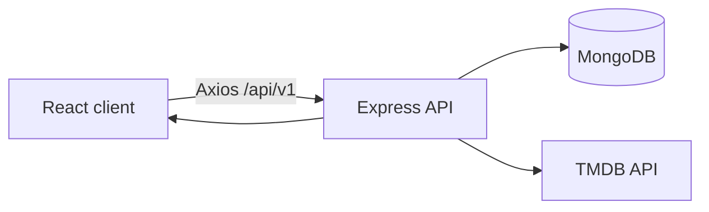
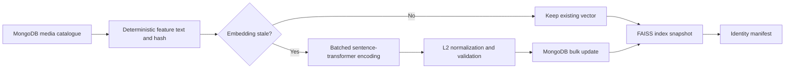

# TagMyMovie ML Recommendation System

This document records the verified application architecture and the phased integration of the recommendation system. It currently covers Phase 1 only. Later phases must extend it without treating planned components as implemented.

## Phase 1: verified existing architecture

### Request flow



The repository contains a Create React App client and an ES-module Express server. Express mounts all application routes below `/api/v1`. MongoDB stores users, favourites, and reviews. Media catalogue, search, credits, videos, images, and generic recommendations are fetched from TMDB; there is no local recommendation model or normalized media catalogue yet.

### Authentication

- `Authorization: Bearer <JWT>` is decoded by `token.middleware.js` using `TOKEN_SECRET`.
- The JWT payload stores the MongoDB user ID in `data`.
- Protected-route middleware loads that user with `User.findById(decoded.data)`, assigns the Mongoose document to `req.user`, and controllers use `req.user.id`.
- Media detail is publicly accessible in practice: the client sends a private-client request, but the server route is not protected. The controller optionally decodes a token to populate `isFavourite`.
- The Redux `user` slice stores the authenticated user and favourites. The token is stored in local storage under `actkn`.

### Existing backend routes

| Method | Route | Authentication | Behaviour |
| --- | --- | --- | --- |
| POST | `/api/v1/user/signup` | No | Create user and JWT |
| POST | `/api/v1/user/signin` | No | Validate password and return JWT |
| GET | `/api/v1/user/info` | JWT | Return current user |
| PUT | `/api/v1/user/update-password` | JWT | Change password |
| GET | `/api/v1/user/favourites` | JWT | List current user's favourites |
| POST | `/api/v1/user/favourites` | JWT | Add or return an existing favourite |
| DELETE | `/api/v1/user/favourites/:favouriteId` | JWT | Remove an owned favourite |
| GET | `/api/v1/reviews` | JWT | List current user's reviews |
| POST | `/api/v1/reviews` | JWT | Create a review |
| DELETE | `/api/v1/reviews/:reviewId` | JWT | Remove an owned review |
| GET | `/api/v1/:mediaType/search` | No | Proxy TMDB search |
| GET | `/api/v1/:mediaType/genres` | No | Proxy TMDB genres |
| GET | `/api/v1/:mediaType/detail/:mediaId` | Optional JWT | Compose TMDB detail and local user data |
| GET | `/api/v1/:mediaType/:mediaCategory` | No | Proxy TMDB media lists |
| GET | `/api/v1/person/:personId` | No | Proxy TMDB person detail |
| GET | `/api/v1/person/:personId/medias` | No | Proxy TMDB person credits |

Validation errors are converted to a single `400` response by the request handler. The response handler provides the existing `200`, `201`, `400`, `401`, `404`, and generic `500` response shapes.

### Existing recommendation-related UI

- The homepage contains a hero followed by generic popular and top-rated movie and TV slides.
- `MediaSlide` fetches a TMDB list and renders reusable `MediaItem` cards in `AutoSwiper`.
- Search renders TMDB results through `MediaGrid` and the same `MediaItem` component.
- Media detail displays TMDB recommendations in `RecommendSlide` under “you may also like,” with a top-rated TMDB slide as fallback.
- The review form currently accepts text only. Ratings and review updates are not implemented yet.
- The authenticated favourite list and review list use the stored MongoDB media metadata.

### Existing TMDB integration

The server exposes methods for media lists, details, genres, credits, videos, images, recommendations, search, person details, and person credits. URLs are generated from `TMDB_BASE_URL` and `TMDB_KEY`. HTTP calls have a ten-second timeout. A development filesystem cache can supply selected responses; it is ignored by Git and is not a normalized ML catalogue.

### Environment and Git behaviour

Server runtime variables currently used:

```text
PORT
MONGODB_URL
TMDB_BASE_URL
TMDB_KEY
TOKEN_SECRET
```

The React API base URL is now configured by `REACT_APP_API_BASE_URL`. When absent it falls back to `http://localhost:5001/api/v1/` only in development and `/api/v1/` in production.

Root ignore rules exclude environment files, dependencies, builds, coverage, logs, local TMDB cache data, backup files, and local database/password diagnostic scripts. Both client and server provide safe `.env.example` files. The real `server/.env` remains ignored and untracked.

### Phase 1 corrections

The canonical media identity is:

```text
mediaType + mediaId
```

Phase 1 applies that identity to:

- Favourite duplicate lookup
- Media-detail favourite lookup
- Media-detail review lookup
- Favourite Redux removal
- Favourite-card state detection
- Favourite removal from the detail and favourite-list pages
- Stored favourite and review lookup indexes
- Stored-media navigation from favourite and review lists

The added indexes are non-unique to remain safe with existing data. Review uniqueness and any data migration belong to the ratings/reviews phase after existing records are inspected.

The server now uses `node index.js` for its normal `start` script and retains `nodemon index.js` as `dev`.

### Audit findings deferred from Phase 1

- The current lockfiles install successfully, but `npm audit` reports 38 server vulnerabilities (2 critical) and 74 client vulnerabilities (6 critical). Automatic audit fixes were not applied because this phase prohibits broad dependency upgrades and forced fixes may be breaking.
- The project has no application-specific automated tests yet. Test infrastructure and comprehensive backend, frontend, and Python coverage are assigned to the testing phase.
- The local TMDB filesystem cache depends on the server process working directory. It remains a development fallback and must not be reused as the ML catalogue.
- JWTs are stored in browser local storage by the existing application. The recommendation work will preserve authentication compatibility; a broader authentication hardening effort is outside Phase 1.
- The legacy JWT dependency chain fails under Node 25 because that runtime removed an API used by a transitive package. The Express server declares support for Node 18 through Node 24; its module graph was successfully smoke-tested with Node 24. A later controlled dependency upgrade should remove this upper bound.

## Not implemented yet

No interaction model, preference model, recommendation-impression model, media catalogue, embedding model, vector store, collaborative model, hybrid ranker, ML service, recommendation API, tracking UI, evaluation pipeline, or ML artifact has been added in Phase 1.

## Phase 2: interaction data foundation

### Interaction collection

Phase 2 adds the `Interaction` collection with the following core identity:

```text
user + mediaType + mediaId + eventType + createdAt
```

Each document stores the authenticated user, compound movie/TV identity, event type, numeric value, source, optional recommendation attribution, optional browser-session ID, constrained metadata, and timestamps. Repeated views and clicks remain valid over time; no unique index permanently suppresses them.

Indexes support:

- Recent interactions by user
- User history for a compound media identity
- Recent event types by user
- Recommendation attribution
- Per-title event analysis using `mediaType + mediaId`

Supported event types are:

```text
detail_view
search_click
recommendation_impression
recommendation_click
trailer_play
favourite_add
favourite_remove
review_create
review_update
rating_submit
not_interested
onboarding_favourite
```

The latter four state-changing events are part of the stable data contract but are not emitted until their corresponding review-update, rating, feedback, and onboarding features exist.

### Interaction recording service

All interaction writes pass through `interaction.service.js`. The service:

- Validates event and source values centrally.
- Requires `movie` or `tv` and normalizes `mediaId` to a string.
- Validates MongoDB user IDs.
- Bounds numeric values and attribution string lengths.
- Accepts only shallow metadata containing safe keys and primitive values or primitive arrays.
- Rejects nested objects and MongoDB operator-shaped keys.
- Limits metadata to 20 keys, arrays to 20 items, and serialized metadata to 2 KB.
- Performs awaited writes for the explicit interaction endpoint.
- Provides non-blocking, best-effort writes for analytics attached to favourites and reviews.
- Logs only the failed event type and error name when secondary analytics fail.

Favourite and review controllers construct database records from explicit accepted fields. Client payloads cannot override the authenticated owner.

### Deduplication

Default deduplication rules are:

| Event | Rule |
| --- | --- |
| `detail_view` | Same user, compound media, event, and session within 15 minutes |
| `search_click` | Same user, compound media, event, and session within 5 minutes |
| `trailer_play` | Same user, compound media, event, and session within 15 minutes |
| `recommendation_click` | Once per recommendation batch and compound item when a recommendation ID exists; otherwise 5-minute session window |
| `recommendation_impression` | Once per user and recommendation batch |

The time windows can be configured through `INTERACTION_*_DEDUP_MINUTES` environment variables. Stateful events such as favourite additions and removals are recorded only after the corresponding state transition succeeds and are not time-window deduplicated.

### Frontend interaction endpoint

```text
POST /api/v1/interactions
```

The endpoint requires JWT authentication and always derives the user from `req.user.id`. It accepts only these browser-originating events:

```text
detail_view
search_click
recommendation_click
trailer_play
```

The browser cannot submit favourite, review, rating, onboarding, impression, or negative-feedback state transitions through this endpoint. Those trusted events must originate from server-side application actions.

The endpoint also fixes browser-event values at `1` and derives the expected source from the event type. Client payloads cannot inject user IDs, event weights, or alternate sources.

The browser stores a random tab-session identifier in `sessionStorage` and includes it with frontend events. Failed analytics calls do not delay navigation or display user-facing errors.

### Events integrated in Phase 2

- Authenticated media-detail load → `detail_view`
- Authenticated movie/TV search-result click → `search_click`
- Authenticated opening of the trailer section → `trailer_play`
- Authenticated generic TMDB recommendation click → `recommendation_click` with rank, seed ID, context, and `tmdb_fallback` strategy
- Successful new favourite → `favourite_add`
- Successful favourite removal → `favourite_remove`
- Successful review creation → `review_create`

Background TMDB fetches and component rendering are not treated as interactions. The current embedded YouTube player does not expose a player-state API, so Phase 2 records the explicit user action that opens the trailer section rather than iframe loading.

### Deferred integrations

These are intentionally deferred because their product actions do not exist yet:

- `review_update` and `rating_submit`: ratings/review-update phase
- `not_interested`: personalized recommendation feedback phase
- `onboarding_favourite`: onboarding/preferences phase
- `recommendation_impression`: recommendation-impression batch phase

No collaborative model is trained in Phase 2.

## Phase 3: ratings and explicit preferences

### Review ratings and updates

Reviews now support an optional `rating` from `1.0` through `10.0` in half-point steps. Existing reviews without ratings remain valid. Review text is trimmed, limited to 2,000 characters, and is optional when a rating is supplied.

The accepted combinations are:

| Text | Rating | Accepted |
| --- | --- | --- |
| Present | Present | Yes |
| Present | Absent | Yes |
| Absent | Present | Yes (rating-only review) |
| Absent | Absent | No |

The backend validates the payload independently of the UI. The Mongoose schema repeats the range and half-step constraints as a second line of defence.

Review endpoints are:

```text
POST   /api/v1/reviews
PUT    /api/v1/reviews/:reviewId
DELETE /api/v1/reviews/:reviewId
```

The update route only permits the authenticated owner to edit a review. It accepts text, rating, or both, and validates the final stored document so an update cannot leave both fields empty.

The application enforces one review per:

```text
user + mediaType + mediaId
```

It rejects a second create request and directs the user to update the existing review. A unique database index has deliberately not been added yet because the configured MongoDB hostname could not be resolved during the read-only duplicate audit. Adding that index without inspecting existing data could fail deployment or conceal existing duplicates.

The dry-run command is:

```bash
cd server
npm run audit:review-duplicates
```

After reviewing the dry-run counts, explicit deduplication can be invoked with:

```bash
node scripts/dedupe-reviews.js --apply --confirm-deduplicate-reviews
```

The utility keeps the most recently updated record in each compound-identity group. Before deletion it writes a permission-restricted JSON backup under the ignored `server/migration-backups/` directory. The backup contains private review data and must not be committed or shared. A unique compound index should be added only after a successful zero-duplicate audit.

Successful review creation emits `review_create`. Creating or updating a rating emits `rating_submit` with the validated rating value. Successful review edits emit `review_update`. These remain best-effort secondary analytics and cannot make review operations fail.

### Rating UI

The media-detail review form provides a labelled Material UI rating control with ten stars and half-step precision. Users may submit review text, a rating, or both. A user who already reviewed the compound movie/TV identity sees their existing review rather than another creation form and can edit or remove it. Review cards and the profile review list display the numeric score and a read-only accessible rating control.

### User preferences

Phase 3 adds a one-to-one `UserPreference` document containing:

```text
user
preferredGenreIds
preferredLanguages
favouriteSeedMedia
preferredReleasePeriods
excludePreviouslyFavourited
excludePreviouslyRated
onboardingCompleted
onboardingSkipped
createdAt
updatedAt
```

Genre IDs are positive integers. Languages are normalized lowercase two- or three-letter codes. Seed media use the compound `mediaType + mediaId` identity and reject duplicates. Preference arrays are bounded, unknown fields are rejected, and completion/skip flags are kept mutually exclusive.

Protected preference endpoints are:

```text
GET  /api/v1/user/preferences
PUT  /api/v1/user/preferences
POST /api/v1/user/preferences/reset
```

The reset endpoint requires:

```json
{ "confirm": true }
```

Reset removes the explicit preference document so defaults are recreated on the next read. It does not delete the user, reviews, favourites, or interaction history. Consequently, later content profiles may still learn from interaction-derived preferences after an explicit-preference reset; this distinction is returned as `interactionHistoryCleared: false`.

The onboarding and preference-editing UI remains assigned to its later frontend phase. Phase 3 establishes the validated storage and API contracts only.

## Phase 4: recommendation impression tracking

### RecommendationImpression collection

Phase 4 adds one document per recommendation batch. A batch contains:

```text
recommendationId
user
context
strategy
modelVersions
items
createdAt
updatedAt
```

`recommendationId` is a unique UUID generated on the server. User identity is derived from the authenticated request and is never accepted from the browser.

Context records the page, requested media type, and optional compound seed identity. Every item stores:

```text
mediaType + mediaId
rank
finalScore
sourceModels
```

The service rejects duplicate compound items, invalid ranks, non-finite scores, unknown model-version fields, and malformed source provenance. Item lists are limited to 500 entries. Embeddings, private review content, debug feature vectors, and raw ranking-feature payloads are never stored in impression documents.

Model-version fields are present for:

```text
embedding
collaborative
profile
ranking
diversity
```

They remain `null` for the current TMDB fallback because no local ML models exist yet. Similarly, `finalScore` is stored as `null`; the system does not fabricate scores for TMDB results.

### Existing media-detail integration

For an authenticated media-detail request with TMDB recommendations, Express now:

1. Removes duplicate or invalid TMDB recommendation IDs while preserving order.
2. Creates a `RecommendationImpression` batch.
3. Records `media_detail` context and the current title as the compound seed.
4. Records `tmdb_fallback` as the truthful strategy.
5. Records `tmdb` as each item's source model.
6. Adds `recommendationId` and `recommendationStrategy` to the media-detail response.
7. Preserves the existing `media.recommend` array for backward compatibility.

The React recommendation click event now includes the returned recommendation ID, strategy, one-based rank, compound media identity, and seed context. The Phase 2 interaction deduplication rule therefore suppresses repeated clicks only for the same recommendation batch and compound item.

If impression persistence fails, the media-detail request still returns its TMDB recommendations without an ID. The failure log includes only the error name and fallback strategy. This preserves browsing reliability while avoiding false click attribution to a batch that was not stored.

Anonymous users retain the same generic TMDB recommendations and do not create user-linked impression records.

The batch collection is the canonical impression record. Phase 4 does not create one generic `Interaction` row per displayed item, because that would duplicate the batch payload and the Phase 2 event-level deduplication intentionally permits only one impression event per recommendation ID. Item-level exposure is represented by the ordered `items` array instead.

### Retention

The collection has indexes for:

- Unique recommendation ID
- Recent batches by user
- Recent batches by page context
- TTL expiry on `createdAt`

The default retention period is 90 days and can be configured with:

```text
RECOMMENDATION_IMPRESSION_RETENTION_DAYS=90
```

Changing the environment value changes the desired Mongoose index definition. Existing MongoDB TTL indexes may need to be updated explicitly during deployment because MongoDB does not always replace an index when only its options change.

### Deferred recommendation flows

Homepage personalized impressions and ML-generated media-detail impressions will reuse the same recording service when their recommendation endpoints are implemented. Phase 4 does not add the FastAPI service, hybrid ranking, model artifacts, or personalized homepage UI.

## Phase 5: local media catalogue

### Collection contract

Phase 5 adds the normalized MongoDB collection:

```text
media_catalog
```

The explicit collection name prevents Mongoose pluralization from creating a different namespace than the later Python pipeline. Both Express-side validation and future Python ingestion must use this same collection.

Each document contains:

```text
tmdbId
mediaType
title
originalTitle
overview
genres
genreIds
originalLanguage
spokenLanguages
releaseDate
releaseYear
cast
directors
creators
keywords
popularity
voteAverage
voteCount
posterPath
backdropPath
featureText
featureHash
embedding
embeddingDimension
embeddingModel
embeddingVersion
lastSyncedAt
createdAt
updatedAt
```

Movie and TV identities remain distinct through the unique compound index:

```text
tmdbId + mediaType
```

This permits `movie:603` and `tv:603` to coexist while rejecting duplicate records for either compound identity.

### Normalized metadata

Genres are stored in both display and filtering forms:

```json
{
  "genres": [{ "id": 878, "name": "Science Fiction" }],
  "genreIds": [878]
}
```

The schema rejects duplicate or non-positive normalized genre IDs. Dates are stored as MongoDB dates and release years as numbers. Numeric popularity, vote average, and vote count fields default to zero. Missing optional textual and list metadata use empty strings or arrays instead of values such as `undefined`.

The following filter indexes are defined:

```text
mediaType
genreIds
originalLanguage
releaseYear
voteCount
```

### Embedding placeholders and consistency

Phase 5 defines storage for future content embeddings but does not generate them. New catalogue records may use:

```json
{
  "featureText": "",
  "featureHash": "",
  "embedding": [],
  "embeddingDimension": 0,
  "embeddingModel": null,
  "embeddingVersion": null
}
```

When an embedding is added in the embedding phase, schema validation requires:

- Every vector value to be finite.
- `embeddingDimension` to match the vector length.
- `embeddingModel` and `embeddingVersion` to be present.
- `embeddingDimension` to remain zero while the vector is empty.

This prevents incomplete or dimensionally inconsistent vectors from entering the catalogue. It does not claim that an embedding is normalized; vector normalization is enforced by the later embedding pipeline.

### Phase boundary

Phase 5 adds only the collection model, indexes, consistency validation, tests, and documentation. It does not call TMDB, create catalogue records, generate feature text, calculate hashes, generate embeddings, or build a vector index. Those operations begin with the idempotent Python catalogue-ingestion job in Phase 6.

## Phase 6: TMDB catalogue ingestion

### Python job structure

Phase 6 introduces the Python `ml-service` foundation with separate modules for:

```text
Configuration
Structured logging
MongoDB connection and indexes
TMDB HTTP access
TMDB-to-catalogue normalization
Catalogue persistence
Pipeline orchestration
CLI entry point
Isolated tests
```

The ingestion command is:

```bash
cd ml-service
python -m jobs.build_media_catalog
```

It is an offline job. It is not invoked by an Express/FastAPI request and is not run during service startup.

### Source coverage

The job imports configurable pages from:

| Media type | Sources |
| --- | --- |
| Movies | Popular, top rated, trending weekly, now playing |
| TV | Popular, top rated, trending weekly, currently airing |

Each compound `mediaType + tmdbId` is fetched at most once per run even if it appears in multiple lists or pages.

For each discovered title, one TMDB detail call uses `append_to_response=credits,keywords`. This avoids separate detail, credits, and keyword calls while collecting overview, genres, cast, director/creators, keywords, languages, dates, popularity, vote data, and image paths.

### HTTP reliability

The TMDB client provides:

- Configurable request timeout.
- Configurable request pacing.
- Exponential backoff for timeouts, connection failures, HTTP 429, and HTTP 5xx.
- `Retry-After` support for rate-limit responses.
- No retries for permanent HTTP 4xx responses.
- API-key query authentication or bearer-token authentication.
- Bounded retry attempts with no infinite loop.

Individual list pages and titles fail independently. Their failures are counted and logged without exposing credentials or full payloads, while remaining records continue processing. Configuration, MongoDB, and other pipeline-level failures return a non-zero process status. A completed partial sync returns its explicit failed count for monitoring.

### Normalization

TMDB responses are normalized into the Phase 5 `media_catalog` contract. Normalization:

- Converts TMDB IDs to strings.
- Preserves movie/TV identity.
- Collapses repeated whitespace.
- Deduplicates genre IDs, people, languages, and keywords while preserving order.
- Limits cast and keyword list lengths through configuration.
- Extracts movie directors from crew jobs.
- Extracts TV creators from `created_by`.
- Handles both movie and TV keyword response shapes.
- Parses valid dates into timezone-aware UTC datetimes.
- Uses `null` dates/years when TMDB dates are absent or invalid.
- Bounds popularity, vote average, and vote count at valid non-negative values.
- Rejects details without a numeric TMDB ID or title.

### Incremental and full modes

`CATALOGUE_SYNC_MODE=incremental` skips details synchronized within `CATALOGUE_INCREMENTAL_MAX_AGE_HOURS`. `full` refreshes every title discovered during the run.

Writes use unordered MongoDB bulk upserts in configurable batches. The job reports:

```text
discovered
fetched
created
updated
unchanged
failed
```

Metadata comparisons distinguish updated and unchanged records. MongoDB reads are timezone-aware so stored dates compare consistently with normalized UTC values.

The upsert `$set` contains catalogue metadata only. Existing `featureText`, `featureHash`, embeddings, dimensions, model names, and versions are never overwritten. New records receive empty embedding placeholders through `$setOnInsert`. Consequently, unchanged titles preserve their embeddings; changed metadata remains available for the Phase 7/8 feature-hash checks to identify and regenerate stale embeddings.

### Configuration

The job reuses existing environment names where possible:

```text
MONGODB_URL
TMDB_BASE_URL
TMDB_KEY
```

It also supports:

```text
MONGODB_DATABASE
TMDB_API_KEY
TMDB_ACCESS_TOKEN
CATALOGUE_MOVIE_PAGES
CATALOGUE_TV_PAGES
CATALOGUE_SYNC_MODE
CATALOGUE_INCREMENTAL_MAX_AGE_HOURS
CATALOGUE_BATCH_SIZE
CATALOGUE_CAST_LIMIT
CATALOGUE_KEYWORD_LIMIT
TMDB_REQUEST_TIMEOUT_SECONDS
TMDB_MAX_RETRIES
TMDB_RETRY_BACKOFF_SECONDS
TMDB_REQUESTS_PER_SECOND
```

The `.env.example` contains empty credential values. The actual `ml-service/.env`, virtual environment, datasets, caches, and generated artifacts are ignored by Git.

### Phase boundary

Phase 6 does not generate deterministic feature text, compute hashes, load a sentence transformer, generate embeddings, build FAISS indexes, or expose HTTP inference. Those begin in later phases.

## Phase 7: deterministic feature text

### Text contract

Phase 7 converts each normalized catalogue record into one deterministic, labelled string. Present fields always appear in this order:

```text
Title
Type
Genres
Original language
Release year
Directors (movie) or Creators (TV)
Cast
Keywords
Plot
```

Every value is normalized to Unicode NFC, leading and trailing whitespace is removed, and internal whitespace is collapsed. Missing optional values are omitted together with their labels, so generated text never contains placeholder values such as `None` or `undefined`. A missing title or invalid media type is rejected.

Genres, directors, creators, and keywords are deduplicated and sorted case-insensitively. Cast is deduplicated while retaining source billing order. Cast and keyword counts are bounded by `FEATURE_TEXT_CAST_LIMIT` (default 10) and `FEATURE_TEXT_KEYWORD_LIMIT` (default 20). Positive limits are required.

### Hash and embedding staleness

The complete normalized feature text is encoded as UTF-8 and hashed with SHA-256. The resulting lowercase hexadecimal digest is the `featureHash` used to decide whether an existing embedding remains reusable.

An embedding requires regeneration when any of these conditions is true:

- The stored feature hash differs from the newly calculated hash.
- The embedding model or version differs from the requested model or version.
- The vector is missing or empty.
- `embeddingDimension` does not equal the vector length.
- Any vector value is non-numeric or non-finite.

These checks make catalogue metadata changes and model upgrades explicit rather than relying on timestamps.

### Phase boundary

Phase 7 implements deterministic text generation, hashing, staleness checks, configuration, and isolated tests only. It does not load a sentence transformer, calculate or persist embeddings, build a vector index, schedule an embedding job, or expose HTTP inference. Content embeddings begin in Phase 8.

## Phase 8: content embeddings

### Offline command

Run the content build independently from ingestion and HTTP startup:

```bash
cd ml-service
python -m jobs.build_content_index
```

The command follows this local flow:



The default pretrained model is `sentence-transformers/all-MiniLM-L6-v2`; another compatible sentence-transformer such as `intfloat/multilingual-e5-small` can be selected through configuration. No transformer is trained, and no paid embedding API is called. The model loader is process-cached, so a given model is loaded once per Python process.

### Incremental generation and reliability

Every catalogue record is scanned and its current deterministic feature text/hash is calculated. Existing vectors are retained when the feature hash, requested model, requested version, dimensions, and values are current. Stale records are encoded in configurable batches with `normalize_embeddings=True`, then independently normalized and checked for non-empty, finite, consistent dimensions before persistence.

If batch encoding fails, each item is retried separately. Invalid records are counted without preventing valid siblings from being stored. MongoDB writes are unordered bulk operations and include the previously observed feature hash and update timestamp in their filter, preventing a concurrent catalogue change from being overwritten. The summary reports `scanned`, `unchanged`, `generated`, `persisted`, `failed`, and `indexed` counts.

### FAISS artifact

After persistence, records matching the configured model, version, and the feature hash calculated during the current run are sorted by compound media identity and written to an exact inner-product FAISS index. Failed or concurrently changed stale records are therefore excluded. Because all vectors are L2-normalized, inner product represents cosine similarity. A JSON manifest records the matching FAISS row order, compound `mediaType + tmdbId` identities, dimension, count, backend, model, and version. Temporary files are replaced atomically and generated artifacts remain excluded from Git.

Configuration:

```text
EMBEDDING_MODEL=sentence-transformers/all-MiniLM-L6-v2
EMBEDDING_VERSION=content-embedding-v1
EMBEDDING_BATCH_SIZE=64
VECTOR_BACKEND=faiss
VECTOR_INDEX_NAME=media_embedding_index
CONTENT_ARTIFACT_DIRECTORY=artifacts/content
```

### Phase boundary

Phase 8 generates and stores embeddings and builds the local FAISS artifact. It does not yet expose the backend-neutral vector-search interface, MongoDB/FAISS store implementations, or candidate search API; those belong to Phase 9.

## Phase 9: vector-search abstraction

### Neutral contract

Recommendation code can now depend on `VectorStore` rather than backend-specific syntax. The contract exposes `upsert`, `search`, `delete`, and `health_check`, with typed items, results, health status, and filters. A factory selects `faiss` or `mongodb` through `VECTOR_BACKEND`; unsupported backends fail configuration rather than silently falling back.

Both implementations validate finite, non-zero vectors and consistent dimensions. Search requires `num_candidates` to be at least the final positive `limit`, ensuring candidate retrieval is broader than the returned result set. Supported neutral filters are:

- Movie or TV media type.
- Original language.
- Any matching genre ID.
- Minimum and maximum release year.
- Minimum vote count.

Default retrieval settings are `CONTENT_CANDIDATE_LIMIT=150` and `VECTOR_NUM_CANDIDATES=300`.

### Local FAISS backend

The FAISS implementation uses normalized vectors with an exact inner-product index, making scores cosine-equivalent. Its stable JSON row-to-compound-media mapping also contains all filter metadata. Upserting an existing `mediaType + tmdbId` replaces its vector instead of duplicating it; deletion rebuilds the index without removed rows. Every mutation is sorted by compound key and safely rebuilt through temporary files and atomic replacement. Health checks reject missing, unreadable, count-mismatched, or dimension-mismatched artifact pairs.

### MongoDB Atlas backend

The MongoDB implementation generates a `$vectorSearch` aggregation and translates the same neutral filters into Atlas pre-filters. It normalizes and dimension-checks query and stored vectors, performs unordered updates by compound media identity, clears deleted vectors and their model metadata, and checks MongoDB connectivity plus the indexed-vector count.

Create the Atlas index named by `VECTOR_INDEX_NAME` on the `media_catalog` collection using `docs/atlas-vector-search-index.json`. The supplied definition indexes `embedding` with cosine similarity and filter paths for `mediaType`, `originalLanguage`, `genreIds`, `releaseYear`, and `voteCount`. Its default 384 dimensions match MiniLM; the definition must be changed when `EMBEDDING_MODEL` has a different dimension. Atlas builds and updates this search index asynchronously after MongoDB vector persistence.

### Phase boundary

Phase 9 provides storage and nearest-neighbour search only. It does not calculate user taste profiles or turn interactions into a query vector; content-based user profiles begin in Phase 10.

## Phase 10: content-based user profiles

### Evidence and versioned weights

The content profile consumes current-model embeddings for compound `mediaType + mediaId` identities from onboarding seed media and these interaction events:

| Evidence | Base weight |
| --- | ---: |
| Detail view | 0.20 |
| Search click | 0.50 |
| Recommendation click | 0.75 |
| Trailer play | 1.00 |
| Review creation | 0.50 |
| Rating 7.0–8.5 | 2.00 |
| Rating 9.0–10.0 | 3.00 |
| Favourite added | 4.00 |
| Onboarding favourite | 4.00 |
| Rating 3.5–5.0 | -1.00 |
| Rating 1.0–3.0 | -3.00 |
| Favourite removed | -1.50 |
| Not interested | -4.00 |

Ratings from 5.5 through 6.5 are neutral. All values live in the centralized `interaction-weights-v1` configuration. The latest rating replaces older ratings for the same title; likewise, only the latest add/remove favourite state and latest not-interested state are used. This prevents obsolete state transitions from cancelling or overpowering a user’s current preference. Onboarding seed media receive their weight directly when no matching onboarding interaction exists, preventing double counting.

### Decay, aggregation, and formula

For an event age measured in fractional days:

```text
effective_weight = base_weight × RECENCY_DECAY_FACTOR ^ days_since_event
```

`RECENCY_DECAY_FACTOR` defaults to `0.98`. Future timestamps are treated as age zero and are never boosted. Repeated weak positive signals (views, search/recommendation clicks, and trailer plays) are summed per media and capped together at `PROFILE_WEAK_POSITIVE_CAP=2.0`. Strong explicit signals are then added, ensuring repeated browsing cannot outweigh one favourite weight of 4.0.

Let `eᵢ` be a normalized media embedding, `wᵢ+` its aggregated positive weight, and `wᵢ-` the magnitude of its aggregated negative weight:

```text
W+ = Σ wᵢ+
W- = Σ wᵢ-
positive_centroid = Σ(wᵢ+ × eᵢ) / W+
negative_centroid = Σ(wᵢ- × eᵢ) / W-
negative_fraction = PROFILE_NEGATIVE_CENTROID_SCALE × min(1, W- / W+)
raw_profile = positive_centroid - negative_fraction × negative_centroid
profile = L2_normalize(raw_profile)
```

The negative scale defaults to `0.35`, so negative evidence changes direction without dominating positive taste. Invalid, non-finite, missing, and dimensionally inconsistent media vectors do not contribute.

### Cold start and data access

`ContentProfileRepository` reads the user’s supported interactions, `UserPreference.favouriteSeedMedia`, and only catalogue vectors matching the configured embedding model/version. `UserContentProfileBuilder` returns a versioned `ContentProfile` with total evidence weights and contributing-media count.

If no usable positive evidence exists, no corresponding embeddings exist, or subtraction produces a zero/invalid vector, the result is explicitly `status=cold_start` with an empty vector and a reason. Negative-only history is not inverted into a speculative taste profile.

Configuration:

```text
PROFILE_VERSION=user-profile-v1
RECENCY_DECAY_FACTOR=0.98
PROFILE_WEAK_POSITIVE_CAP=2.0
PROFILE_NEGATIVE_CENTROID_SCALE=0.35
```

### Phase boundary

Phase 10 builds an in-memory content query vector but does not yet generate candidates or train a collaborative model. Interaction aggregation for the collaborative sparse matrix begins in Phase 11; content candidate generation remains in its later assigned phase.

## Phase 11: collaborative-filtering dataset

### Source validation and identity

Run the offline dataset build with:

```bash
cd ml-service
python -m jobs.build_interaction_matrix
```

The job reads MongoDB without deleting or rewriting source interactions. Every record must have a user, valid movie/TV identity, and datetime timestamp. The referenced user must still exist in `users`, and the exact compound identity must exist in `media_catalog`. Consequently, `movie:603` and `tv:603` are distinct matrix columns.

Pure recommendation impressions, negative/neutral signals, malformed records, unresolved/deleted users, unresolved catalogue items, and exact duplicate analytics records do not become positive entries. Exact duplicates are identified from user, compound item, event, value, timestamp, session, and recommendation identifiers. Only the latest rating, favourite add/remove state, and onboarding-favourite state per user/item are used.

### Implicit confidence

The centralized `implicit-confidence-v1` weights are:

| Positive evidence | Confidence |
| --- | ---: |
| Detail view | 0.10 |
| Search click | 0.30 |
| Recommendation click | 0.75 |
| Trailer play | 1.00 |
| Rating 7.0–8.5 | 2.00 |
| Rating 9.0–10.0 | 3.00 |
| Favourite added | 4.00 |
| Onboarding favourite | 4.00 |

Ratings from 1 through 5, favourite removals, and not-interested events contribute zero positive ALS confidence. Those records remain available for later exclusions and ranking penalties.

Each retained event first receives time decay:

```text
effective = base_confidence × CF_RECENCY_DECAY_FACTOR ^ days_since_event
```

For each user/item pair, weak events (views, clicks, and trailer plays) use logarithmic saturation, while strong rating/favourite evidence remains linear:

```text
weak = min(CF_WEAK_CONFIDENCE_CAP, log1p(sum(effective_weak)))
confidence = min(CF_MAX_CONFIDENCE, sum(effective_strong) + weak)
```

Defaults are decay `0.98`, weak cap `2.0`, and total cap `10.0`. This prevents repeated low-value views from behaving like unlimited explicit preference.

### Sparse matrix and artifacts

Users with fewer than `CF_MIN_USER_ITEMS=2` distinct positive items are excluded from this training/evaluation dataset and reported as weak users. Remaining user IDs and compound item keys are sorted lexicographically before assigning indexes, producing stable mappings for the same input identities. The output is a float32 SciPy CSR user-item matrix.

Each successful build writes:

- A generation-specific compressed matrix (`interaction-matrix-<generation>.npz`).
- A generation-specific JSON mapping containing user/item arrays and both ID-to-index maps.
- `dataset-manifest.json` with shape, non-zero count, versions, summary, and active artifact names.

Matrix and mapping files are completed first; the manifest is atomically replaced last. A failed build therefore does not destroy or activate over the previous working generation. Generated artifacts remain ignored by Git.

Configuration:

```text
CF_ARTIFACT_DIRECTORY=artifacts/collaborative
CF_MATRIX_VERSION=interaction-matrix-v1
CF_RECENCY_DECAY_FACTOR=0.98
CF_WEAK_CONFIDENCE_CAP=2.0
CF_MAX_CONFIDENCE=10.0
CF_MIN_USER_ITEMS=2
```

### Phase boundary

Phase 11 builds and persists the validated dataset and stable mappings only. It does not fit latent factors or produce recommendations; implicit ALS training begins in Phase 12.

## Phase 12: implicit ALS collaborative model

### Training command and verified orientation

Run:

```bash
cd ml-service
python -m jobs.train_collaborative_model
```

The job reloads current MongoDB interactions and reuses the Phase 11 validation, aggregation, confidence, decay, weak-user filtering, sparse matrix, and stable mapping code before training. It uses the open-source `implicit` package and does not treat negative events as observed ALS positives.

The installed `implicit 0.7.x` API explicitly accepts a users-by-items CSR matrix in `fit(user_items)`. Phase 12 passes the matrix without transposition and validates after fitting that `user_factors.shape[0]` equals the user count and `item_factors.shape[0]` equals the item count. Metadata records `matrixOrientation=users_by_items`; tests exercise the installed implementation rather than relying on an assumed orientation.

Initial configurable hyperparameters are:

```text
CF_FACTORS=64
CF_REGULARIZATION=0.05
CF_ITERATIONS=30
CF_ALPHA=20
CF_RANDOM_SEED=42
CF_MODEL_VERSION=als-v1
```

These are reproducible starting values, not claimed optima. The matrix remains float32 and the random seed is supplied directly to ALS.

### Deterministic validation

Before fitting, one observed item is deterministically held out for every eligible user with at least two matrix entries. The remaining users-by-items matrix trains ALS. For every validation user, the model generates up to `CF_EVALUATION_K=10` recommendations while filtering training items.

Metrics are calculated from those actual ranked results:

- Recall@K: fraction of validation users whose held-out item appears.
- HitRate@K: the same binary hit fraction for one-item holdout.
- NDCG@K: mean `1 / log2(rank + 1)` for hits, otherwise zero.

No placeholder metric is written. Promotion requires at least `CF_MIN_VALIDATION_USERS`, correctly shaped finite factor matrices, finite metrics, and Recall@K greater than or equal to `CF_MIN_RECALL_AT_K` (default `0.01`). Empty/insufficient datasets or candidates below the threshold return a non-zero job status and are not promoted.

### Safe artifacts and promotion

Each successful candidate is serialized with the library-supported NPZ format into:

```text
artifacts/collaborative/versions/als-v1-<timestamp>-<seed>/
  model.npz
  user_mapping.json
  item_mapping.json
  model_metadata.json
  evaluation.json
```

Metadata contains the actual training shape/non-zero count, hyperparameters, matrix/confidence versions, source-data time range, trained timestamp, orientation, and measured metrics. Mappings preserve the exact user/item indexes used to train the factor matrices.

All candidate files are completed in a temporary version directory. Only after validation and serialization succeed is the directory finalized and an atomically replaced `current` symlink pointed to it. A failed training, evaluation, or write therefore leaves the previous working model active.

Additional configuration:

```text
CF_EVALUATION_K=10
CF_MIN_VALIDATION_USERS=1
CF_MIN_RECALL_AT_K=0.01
```

### Phase boundary

Phase 12 trains and validates TagMyMovie ALS artifacts. It does not import MovieLens data, blend external identifiers, or infer factors for unseen users; optional MovieLens bootstrap begins in Phase 13 and new-user collaborative inference remains Phase 14.

## Phase 13: optional MovieLens bootstrap

### Explicit local opt-in

MovieLens is disabled by default. TagMyMovie does not automatically download it and never commits the full dataset. After obtaining and extracting a dataset directly from GroupLens and reviewing the README/license included with that release, run:

```bash
cd ml-service
python -m jobs.bootstrap_movielens --dataset-path /path/to/ml-latest-small
```

The path must be a local directory containing standard `links.csv` and `ratings.csv` files with their required headers. The bootstrap command still requires the TagMyMovie MongoDB catalogue because only resolvable catalogue movies are useful to the application. It writes generated sparse artifacts under the already ignored collaborative artifact directory.

### Identity and item mapping

`links.csv` is the sole MovieLens-to-application bridge:

```text
MovieLens movieId -> links.csv tmdbId -> movie:<tmdbId>
```

Blank/invalid links and TMDB IDs absent from TagMyMovie’s movie catalogue are skipped. External rows always use `mediaType=movie`; MovieLens cannot create TV interactions or TV latent evidence. TV recommendations therefore continue to depend on native TagMyMovie behavior and content models.

Every external user is namespaced as `movielens:<userId>` and every normalized record is marked `dataSource=movielens` and `external=true`. Native application users remain their MongoDB ObjectId strings. The namespace prevents collisions, but it does not imply that a MovieLens user is registered with or identifiable as a TagMyMovie user.

MovieLens ratings use a five-point scale. Valid ratings are converted to the existing ten-point scale (`rating × 2`), after which only ratings of at least 3.5/5 (7/10) become positive implicit ALS evidence. Lower ratings are counted and skipped rather than treated as positive. Repeated ratings for the same external user/movie pass through the same latest-state, confidence, saturation, and minimum-item logic as native data.

Native decay uses the real training time. Applying that clock to historical MovieLens releases would reduce decades-old bootstrap ratings almost to zero, so external decay is measured relative to the latest timestamp within the selected MovieLens dataset. This preserves relative recency inside MovieLens without representing external activity as recent TagMyMovie behavior; original timestamps remain unchanged in source-range metadata.

### Training modes and reporting

Training supports:

```text
CF_DATA_SOURCE=tagmymovie  # default; no MovieLens path read
CF_DATA_SOURCE=movielens   # external movie bootstrap only
CF_DATA_SOURCE=combined    # native plus namespaced external users
MOVIELENS_DATASET_PATH=/path/to/ml-latest-small
```

The MovieLens path is mandatory only for `movielens` and `combined`. Dataset summaries and promoted model metadata separately record scanned and retained native/external counts. In combined mode, all users share item factors only where mapped movie identities overlap; their user identities never merge.

ALS always receives an overall held-out evaluation. When combined data contains at least `CF_MIN_VALIDATION_USERS` native users, it additionally records native-only Recall/NDCG/Hit Rate and uses the native metrics for the recall promotion gate. When native data is insufficient, `nativeEvaluationAvailable=false` is explicit and overall bootstrap metrics are not presented as native performance.

### Dataset and licensing limitations

MovieLens remains development/portfolio bootstrap data governed by the terms distributed with the selected GroupLens release. This repository neither redistributes nor vendors its rows. Users must verify that their intended use complies with those terms.

MovieLens users are not TagMyMovie users; its historical movie-rating distribution, coverage, timestamps, and user behavior differ from this application. TMDB links may be absent or stale, TV is missing, and catalogue intersection can be small. MovieLens metrics demonstrate pipeline mechanics only and are not evidence of real TagMyMovie production quality.

### Phase boundary

Phase 13 supplies optional external training evidence and source-aware validation. It does not map anonymous/current application users onto MovieLens identities or infer a collaborative vector for a user absent from the trained mapping; new-user inference begins in Phase 14.

## Phase 14: new-user collaborative inference

### Active artifact loading

The inference layer resolves `artifacts/collaborative/current` and loads the library-supported ALS NPZ plus user mapping, compound item mapping, and metadata. It validates mapping uniqueness and both ID-to-index maps, then confirms that factor row counts match the mappings and all factors are finite. A promoted version is cached by its immutable resolved version path, so requests do not repeatedly load the same model while a newly promoted `current` link naturally selects a new cache entry.

Incomplete, unreadable, or inconsistent artifacts do not crash recommendation handling. They produce an explicit content-fallback result with `model_unavailable`.

### Current-user interaction row

For inference, the user’s current interactions are passed through the same Phase 11 logic used for training:

- Validation and exact deduplication.
- Latest rating/favourite/onboarding state.
- Positive implicit-confidence weights only.
- Native recency decay.
- Logarithmic weak-event saturation and confidence caps.
- Exact compound-item overlap with the active model mapping.

The resulting one-row float32 CSR matrix is projected into the model’s original item-column order. Negative/neutral events never become positive fold-in values.

### Stored and temporary factors

If the application user exists in the active user mapping, ALS recommends with the stored user factor. If the user is absent, Phase 14 calls the installed library’s supported `recalculate_user` method with the temporary interaction row, validates that the resulting factor is one-dimensional, non-empty, finite, and non-zero, and calls `recommend(..., recalculate_user=True)`.

The recalculated factor exists only for that inference call. The system does not retrain the full model, call partial fitting, mutate shared factor arrays, or write a user-specific model artifact.

Collaborative inference activates only when the row contains at least `CF_MIN_OVERLAP_ITEMS=3` distinct mapped positive items. Zero overlap returns `no_overlapping_positive_items`; one or two items return `insufficient_overlapping_items`. Temporary-factor errors, invalid factors, model recommendation errors, and empty/invalid candidate lists also fall back safely.

### Result contract and preliminary confidence

The result always separates:

- `candidates[].raw_score`: the unnormalized finite ALS score.
- `collaborative_confidence`: an overlap-derived confidence, not an ALS score.
- `overlap_items`, `user_in_model`, and `temporary_factor` evidence.
- `strategy`: `collaborative` or `content_fallback`.
- A machine-readable fallback reason and active model version.

Before the minimum overlap, confidence is zero. Once activated:

```text
collaborative_confidence = min(1, overlap_items / CF_FULL_WEIGHT_ITEMS)
```

`CF_FULL_WEIGHT_ITEMS` defaults to 10 and must be at least the minimum-overlap threshold. This preliminary confidence prevents a raw score from masquerading as reliability; Phase 15 expands confidence with interaction age, model recency, coverage, and factor-quality evidence.

Configuration:

```text
CF_MIN_OVERLAP_ITEMS=3
CF_FULL_WEIGHT_ITEMS=10
```

### Phase boundary

Phase 14 provides safe stored/temporary ALS inference and content-fallback signaling. It does not yet calculate the complete dynamic collaborative-confidence policy; that is Phase 15.
