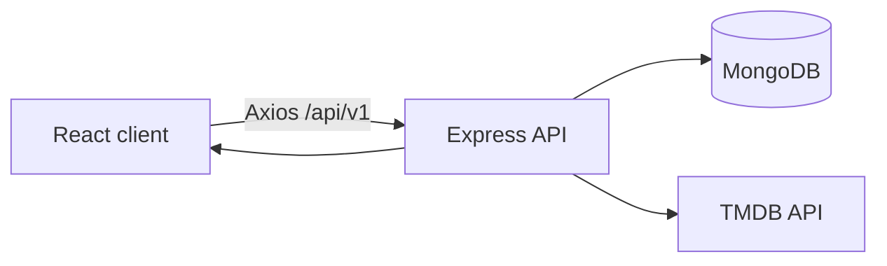

# TagMyMovie ML Recommendation System

This document records the verified application architecture and the phased integration of the recommendation system. It currently covers Phase 1 only. Later phases must extend it without treating planned components as implemented.

## Phase 1: verified existing architecture

### Request flow



The repository contains a Create React App client and an ES-module Express server. Express mounts all application routes below `/api/v1`. MongoDB stores users, favourites, and reviews. Media catalogue, search, credits, videos, images, and generic recommendations are fetched from TMDB; there is no local recommendation model or normalized media catalogue yet.

### Authentication

- `Authorization: Bearer <JWT>` is decoded by `token.middleware.js` using `TOKEN_SECRET`.
- The JWT payload stores the MongoDB user ID in `data`.
- Protected-route middleware loads that user with `User.findById(decoded.data)`, assigns the Mongoose document to `req.user`, and controllers use `req.user.id`.
- Media detail is publicly accessible in practice: the client sends a private-client request, but the server route is not protected. The controller optionally decodes a token to populate `isFavourite`.
- The Redux `user` slice stores the authenticated user and favourites. The token is stored in local storage under `actkn`.

### Existing backend routes

| Method | Route | Authentication | Behaviour |
| --- | --- | --- | --- |
| POST | `/api/v1/user/signup` | No | Create user and JWT |
| POST | `/api/v1/user/signin` | No | Validate password and return JWT |
| GET | `/api/v1/user/info` | JWT | Return current user |
| PUT | `/api/v1/user/update-password` | JWT | Change password |
| GET | `/api/v1/user/favourites` | JWT | List current user's favourites |
| POST | `/api/v1/user/favourites` | JWT | Add or return an existing favourite |
| DELETE | `/api/v1/user/favourites/:favouriteId` | JWT | Remove an owned favourite |
| GET | `/api/v1/reviews` | JWT | List current user's reviews |
| POST | `/api/v1/reviews` | JWT | Create a review |
| DELETE | `/api/v1/reviews/:reviewId` | JWT | Remove an owned review |
| GET | `/api/v1/:mediaType/search` | No | Proxy TMDB search |
| GET | `/api/v1/:mediaType/genres` | No | Proxy TMDB genres |
| GET | `/api/v1/:mediaType/detail/:mediaId` | Optional JWT | Compose TMDB detail and local user data |
| GET | `/api/v1/:mediaType/:mediaCategory` | No | Proxy TMDB media lists |
| GET | `/api/v1/person/:personId` | No | Proxy TMDB person detail |
| GET | `/api/v1/person/:personId/medias` | No | Proxy TMDB person credits |

Validation errors are converted to a single `400` response by the request handler. The response handler provides the existing `200`, `201`, `400`, `401`, `404`, and generic `500` response shapes.

### Existing recommendation-related UI

- The homepage contains a hero followed by generic popular and top-rated movie and TV slides.
- `MediaSlide` fetches a TMDB list and renders reusable `MediaItem` cards in `AutoSwiper`.
- Search renders TMDB results through `MediaGrid` and the same `MediaItem` component.
- Media detail displays TMDB recommendations in `RecommendSlide` under “you may also like,” with a top-rated TMDB slide as fallback.
- The review form currently accepts text only. Ratings and review updates are not implemented yet.
- The authenticated favourite list and review list use the stored MongoDB media metadata.

### Existing TMDB integration

The server exposes methods for media lists, details, genres, credits, videos, images, recommendations, search, person details, and person credits. URLs are generated from `TMDB_BASE_URL` and `TMDB_KEY`. HTTP calls have a ten-second timeout. A development filesystem cache can supply selected responses; it is ignored by Git and is not a normalized ML catalogue.

### Environment and Git behaviour

Server runtime variables currently used:

```text
PORT
MONGODB_URL
TMDB_BASE_URL
TMDB_KEY
TOKEN_SECRET
```

The React API base URL is now configured by `REACT_APP_API_BASE_URL`. When absent it falls back to `http://localhost:5001/api/v1/` only in development and `/api/v1/` in production.

Root ignore rules exclude environment files, dependencies, builds, coverage, logs, local TMDB cache data, backup files, and local database/password diagnostic scripts. Both client and server provide safe `.env.example` files. The real `server/.env` remains ignored and untracked.

### Phase 1 corrections

The canonical media identity is:

```text
mediaType + mediaId
```

Phase 1 applies that identity to:

- Favourite duplicate lookup
- Media-detail favourite lookup
- Media-detail review lookup
- Favourite Redux removal
- Favourite-card state detection
- Favourite removal from the detail and favourite-list pages
- Stored favourite and review lookup indexes
- Stored-media navigation from favourite and review lists

The added indexes are non-unique to remain safe with existing data. Review uniqueness and any data migration belong to the ratings/reviews phase after existing records are inspected.

The server now uses `node index.js` for its normal `start` script and retains `nodemon index.js` as `dev`.

### Audit findings deferred from Phase 1

- The current lockfiles install successfully, but `npm audit` reports 38 server vulnerabilities (2 critical) and 74 client vulnerabilities (6 critical). Automatic audit fixes were not applied because this phase prohibits broad dependency upgrades and forced fixes may be breaking.
- The project has no application-specific automated tests yet. Test infrastructure and comprehensive backend, frontend, and Python coverage are assigned to the testing phase.
- The local TMDB filesystem cache depends on the server process working directory. It remains a development fallback and must not be reused as the ML catalogue.
- JWTs are stored in browser local storage by the existing application. The recommendation work will preserve authentication compatibility; a broader authentication hardening effort is outside Phase 1.
- The legacy JWT dependency chain fails under Node 25 because that runtime removed an API used by a transitive package. The Express server declares support for Node 18 through Node 24; its module graph was successfully smoke-tested with Node 24. A later controlled dependency upgrade should remove this upper bound.

## Not implemented yet

No interaction model, preference model, recommendation-impression model, media catalogue, embedding model, vector store, collaborative model, hybrid ranker, ML service, recommendation API, tracking UI, evaluation pipeline, or ML artifact has been added in Phase 1.

## Phase 2: interaction data foundation

### Interaction collection

Phase 2 adds the `Interaction` collection with the following core identity:

```text
user + mediaType + mediaId + eventType + createdAt
```

Each document stores the authenticated user, compound movie/TV identity, event type, numeric value, source, optional recommendation attribution, optional browser-session ID, constrained metadata, and timestamps. Repeated views and clicks remain valid over time; no unique index permanently suppresses them.

Indexes support:

- Recent interactions by user
- User history for a compound media identity
- Recent event types by user
- Recommendation attribution
- Per-title event analysis using `mediaType + mediaId`

Supported event types are:

```text
detail_view
search_click
recommendation_impression
recommendation_click
trailer_play
favourite_add
favourite_remove
review_create
review_update
rating_submit
not_interested
onboarding_favourite
```

The latter four state-changing events are part of the stable data contract but are not emitted until their corresponding review-update, rating, feedback, and onboarding features exist.

### Interaction recording service

All interaction writes pass through `interaction.service.js`. The service:

- Validates event and source values centrally.
- Requires `movie` or `tv` and normalizes `mediaId` to a string.
- Validates MongoDB user IDs.
- Bounds numeric values and attribution string lengths.
- Accepts only shallow metadata containing safe keys and primitive values or primitive arrays.
- Rejects nested objects and MongoDB operator-shaped keys.
- Limits metadata to 20 keys, arrays to 20 items, and serialized metadata to 2 KB.
- Performs awaited writes for the explicit interaction endpoint.
- Provides non-blocking, best-effort writes for analytics attached to favourites and reviews.
- Logs only the failed event type and error name when secondary analytics fail.

Favourite and review controllers construct database records from explicit accepted fields. Client payloads cannot override the authenticated owner.

### Deduplication

Default deduplication rules are:

| Event | Rule |
| --- | --- |
| `detail_view` | Same user, compound media, event, and session within 15 minutes |
| `search_click` | Same user, compound media, event, and session within 5 minutes |
| `trailer_play` | Same user, compound media, event, and session within 15 minutes |
| `recommendation_click` | Once per recommendation batch and compound item when a recommendation ID exists; otherwise 5-minute session window |
| `recommendation_impression` | Once per user and recommendation batch |

The time windows can be configured through `INTERACTION_*_DEDUP_MINUTES` environment variables. Stateful events such as favourite additions and removals are recorded only after the corresponding state transition succeeds and are not time-window deduplicated.

### Frontend interaction endpoint

```text
POST /api/v1/interactions
```

The endpoint requires JWT authentication and always derives the user from `req.user.id`. It accepts only these browser-originating events:

```text
detail_view
search_click
recommendation_click
trailer_play
```

The browser cannot submit favourite, review, rating, onboarding, impression, or negative-feedback state transitions through this endpoint. Those trusted events must originate from server-side application actions.

The endpoint also fixes browser-event values at `1` and derives the expected source from the event type. Client payloads cannot inject user IDs, event weights, or alternate sources.

The browser stores a random tab-session identifier in `sessionStorage` and includes it with frontend events. Failed analytics calls do not delay navigation or display user-facing errors.

### Events integrated in Phase 2

- Authenticated media-detail load → `detail_view`
- Authenticated movie/TV search-result click → `search_click`
- Authenticated opening of the trailer section → `trailer_play`
- Authenticated generic TMDB recommendation click → `recommendation_click` with rank, seed ID, context, and `tmdb_fallback` strategy
- Successful new favourite → `favourite_add`
- Successful favourite removal → `favourite_remove`
- Successful review creation → `review_create`

Background TMDB fetches and component rendering are not treated as interactions. The current embedded YouTube player does not expose a player-state API, so Phase 2 records the explicit user action that opens the trailer section rather than iframe loading.

### Deferred integrations

These are intentionally deferred because their product actions do not exist yet:

- `review_update` and `rating_submit`: ratings/review-update phase
- `not_interested`: personalized recommendation feedback phase
- `onboarding_favourite`: onboarding/preferences phase
- `recommendation_impression`: recommendation-impression batch phase

No collaborative model is trained in Phase 2.

## Phase 3: ratings and explicit preferences

### Review ratings and updates

Reviews now support an optional `rating` from `1.0` through `10.0` in half-point steps. Existing reviews without ratings remain valid. Review text is trimmed, limited to 2,000 characters, and is optional when a rating is supplied.

The accepted combinations are:

| Text | Rating | Accepted |
| --- | --- | --- |
| Present | Present | Yes |
| Present | Absent | Yes |
| Absent | Present | Yes (rating-only review) |
| Absent | Absent | No |

The backend validates the payload independently of the UI. The Mongoose schema repeats the range and half-step constraints as a second line of defence.

Review endpoints are:

```text
POST   /api/v1/reviews
PUT    /api/v1/reviews/:reviewId
DELETE /api/v1/reviews/:reviewId
```

The update route only permits the authenticated owner to edit a review. It accepts text, rating, or both, and validates the final stored document so an update cannot leave both fields empty.

The application enforces one review per:

```text
user + mediaType + mediaId
```

It rejects a second create request and directs the user to update the existing review. A unique database index has deliberately not been added yet because the configured MongoDB hostname could not be resolved during the read-only duplicate audit. Adding that index without inspecting existing data could fail deployment or conceal existing duplicates.

The dry-run command is:

```bash
cd server
npm run audit:review-duplicates
```

After reviewing the dry-run counts, explicit deduplication can be invoked with:

```bash
node scripts/dedupe-reviews.js --apply --confirm-deduplicate-reviews
```

The utility keeps the most recently updated record in each compound-identity group. Before deletion it writes a permission-restricted JSON backup under the ignored `server/migration-backups/` directory. The backup contains private review data and must not be committed or shared. A unique compound index should be added only after a successful zero-duplicate audit.

Successful review creation emits `review_create`. Creating or updating a rating emits `rating_submit` with the validated rating value. Successful review edits emit `review_update`. These remain best-effort secondary analytics and cannot make review operations fail.

### Rating UI

The media-detail review form provides a labelled Material UI rating control with ten stars and half-step precision. Users may submit review text, a rating, or both. A user who already reviewed the compound movie/TV identity sees their existing review rather than another creation form and can edit or remove it. Review cards and the profile review list display the numeric score and a read-only accessible rating control.

### User preferences

Phase 3 adds a one-to-one `UserPreference` document containing:

```text
user
preferredGenreIds
preferredLanguages
favouriteSeedMedia
preferredReleasePeriods
excludePreviouslyFavourited
excludePreviouslyRated
onboardingCompleted
onboardingSkipped
createdAt
updatedAt
```

Genre IDs are positive integers. Languages are normalized lowercase two- or three-letter codes. Seed media use the compound `mediaType + mediaId` identity and reject duplicates. Preference arrays are bounded, unknown fields are rejected, and completion/skip flags are kept mutually exclusive.

Protected preference endpoints are:

```text
GET  /api/v1/user/preferences
PUT  /api/v1/user/preferences
POST /api/v1/user/preferences/reset
```

The reset endpoint requires:

```json
{ "confirm": true }
```

Reset removes the explicit preference document so defaults are recreated on the next read. It does not delete the user, reviews, favourites, or interaction history. Consequently, later content profiles may still learn from interaction-derived preferences after an explicit-preference reset; this distinction is returned as `interactionHistoryCleared: false`.

The onboarding and preference-editing UI remains assigned to its later frontend phase. Phase 3 establishes the validated storage and API contracts only.

## Phase 4: recommendation impression tracking

### RecommendationImpression collection

Phase 4 adds one document per recommendation batch. A batch contains:

```text
recommendationId
user
context
strategy
modelVersions
items
createdAt
updatedAt
```

`recommendationId` is a unique UUID generated on the server. User identity is derived from the authenticated request and is never accepted from the browser.

Context records the page, requested media type, and optional compound seed identity. Every item stores:

```text
mediaType + mediaId
rank
finalScore
sourceModels
```

The service rejects duplicate compound items, invalid ranks, non-finite scores, unknown model-version fields, and malformed source provenance. Item lists are limited to 500 entries. Embeddings, private review content, debug feature vectors, and raw ranking-feature payloads are never stored in impression documents.

Model-version fields are present for:

```text
embedding
collaborative
profile
ranking
diversity
```

They remain `null` for the current TMDB fallback because no local ML models exist yet. Similarly, `finalScore` is stored as `null`; the system does not fabricate scores for TMDB results.

### Existing media-detail integration

For an authenticated media-detail request with TMDB recommendations, Express now:

1. Removes duplicate or invalid TMDB recommendation IDs while preserving order.
2. Creates a `RecommendationImpression` batch.
3. Records `media_detail` context and the current title as the compound seed.
4. Records `tmdb_fallback` as the truthful strategy.
5. Records `tmdb` as each item's source model.
6. Adds `recommendationId` and `recommendationStrategy` to the media-detail response.
7. Preserves the existing `media.recommend` array for backward compatibility.

The React recommendation click event now includes the returned recommendation ID, strategy, one-based rank, compound media identity, and seed context. The Phase 2 interaction deduplication rule therefore suppresses repeated clicks only for the same recommendation batch and compound item.

If impression persistence fails, the media-detail request still returns its TMDB recommendations without an ID. The failure log includes only the error name and fallback strategy. This preserves browsing reliability while avoiding false click attribution to a batch that was not stored.

Anonymous users retain the same generic TMDB recommendations and do not create user-linked impression records.

The batch collection is the canonical impression record. Phase 4 does not create one generic `Interaction` row per displayed item, because that would duplicate the batch payload and the Phase 2 event-level deduplication intentionally permits only one impression event per recommendation ID. Item-level exposure is represented by the ordered `items` array instead.

### Retention

The collection has indexes for:

- Unique recommendation ID
- Recent batches by user
- Recent batches by page context
- TTL expiry on `createdAt`

The default retention period is 90 days and can be configured with:

```text
RECOMMENDATION_IMPRESSION_RETENTION_DAYS=90
```

Changing the environment value changes the desired Mongoose index definition. Existing MongoDB TTL indexes may need to be updated explicitly during deployment because MongoDB does not always replace an index when only its options change.

### Deferred recommendation flows

Homepage personalized impressions and ML-generated media-detail impressions will reuse the same recording service when their recommendation endpoints are implemented. Phase 4 does not add the FastAPI service, hybrid ranking, model artifacts, or personalized homepage UI.

## Phase 5: local media catalogue

### Collection contract

Phase 5 adds the normalized MongoDB collection:

```text
media_catalog
```

The explicit collection name prevents Mongoose pluralization from creating a different namespace than the later Python pipeline. Both Express-side validation and future Python ingestion must use this same collection.

Each document contains:

```text
tmdbId
mediaType
title
originalTitle
overview
genres
genreIds
originalLanguage
spokenLanguages
releaseDate
releaseYear
cast
directors
creators
keywords
popularity
voteAverage
voteCount
posterPath
backdropPath
featureText
featureHash
embedding
embeddingDimension
embeddingModel
embeddingVersion
lastSyncedAt
createdAt
updatedAt
```

Movie and TV identities remain distinct through the unique compound index:

```text
tmdbId + mediaType
```

This permits `movie:603` and `tv:603` to coexist while rejecting duplicate records for either compound identity.

### Normalized metadata

Genres are stored in both display and filtering forms:

```json
{
  "genres": [{ "id": 878, "name": "Science Fiction" }],
  "genreIds": [878]
}
```

The schema rejects duplicate or non-positive normalized genre IDs. Dates are stored as MongoDB dates and release years as numbers. Numeric popularity, vote average, and vote count fields default to zero. Missing optional textual and list metadata use empty strings or arrays instead of values such as `undefined`.

The following filter indexes are defined:

```text
mediaType
genreIds
originalLanguage
releaseYear
voteCount
```

### Embedding placeholders and consistency

Phase 5 defines storage for future content embeddings but does not generate them. New catalogue records may use:

```json
{
  "featureText": "",
  "featureHash": "",
  "embedding": [],
  "embeddingDimension": 0,
  "embeddingModel": null,
  "embeddingVersion": null
}
```

When an embedding is added in the embedding phase, schema validation requires:

- Every vector value to be finite.
- `embeddingDimension` to match the vector length.
- `embeddingModel` and `embeddingVersion` to be present.
- `embeddingDimension` to remain zero while the vector is empty.

This prevents incomplete or dimensionally inconsistent vectors from entering the catalogue. It does not claim that an embedding is normalized; vector normalization is enforced by the later embedding pipeline.

### Phase boundary

Phase 5 adds only the collection model, indexes, consistency validation, tests, and documentation. It does not call TMDB, create catalogue records, generate feature text, calculate hashes, generate embeddings, or build a vector index. Those operations begin with the idempotent Python catalogue-ingestion job in Phase 6.

## Phase 6: TMDB catalogue ingestion

### Python job structure

Phase 6 introduces the Python `ml-service` foundation with separate modules for:

```text
Configuration
Structured logging
MongoDB connection and indexes
TMDB HTTP access
TMDB-to-catalogue normalization
Catalogue persistence
Pipeline orchestration
CLI entry point
Isolated tests
```

The ingestion command is:

```bash
cd ml-service
python -m jobs.build_media_catalog
```

It is an offline job. It is not invoked by an Express/FastAPI request and is not run during service startup.

### Source coverage

The job imports configurable pages from:

| Media type | Sources |
| --- | --- |
| Movies | Popular, top rated, trending weekly, now playing |
| TV | Popular, top rated, trending weekly, currently airing |

Each compound `mediaType + tmdbId` is fetched at most once per run even if it appears in multiple lists or pages.

For each discovered title, one TMDB detail call uses `append_to_response=credits,keywords`. This avoids separate detail, credits, and keyword calls while collecting overview, genres, cast, director/creators, keywords, languages, dates, popularity, vote data, and image paths.

### HTTP reliability

The TMDB client provides:

- Configurable request timeout.
- Configurable request pacing.
- Exponential backoff for timeouts, connection failures, HTTP 429, and HTTP 5xx.
- `Retry-After` support for rate-limit responses.
- No retries for permanent HTTP 4xx responses.
- API-key query authentication or bearer-token authentication.
- Bounded retry attempts with no infinite loop.

Individual list pages and titles fail independently. Their failures are counted and logged without exposing credentials or full payloads, while remaining records continue processing. Configuration, MongoDB, and other pipeline-level failures return a non-zero process status. A completed partial sync returns its explicit failed count for monitoring.

### Normalization

TMDB responses are normalized into the Phase 5 `media_catalog` contract. Normalization:

- Converts TMDB IDs to strings.
- Preserves movie/TV identity.
- Collapses repeated whitespace.
- Deduplicates genre IDs, people, languages, and keywords while preserving order.
- Limits cast and keyword list lengths through configuration.
- Extracts movie directors from crew jobs.
- Extracts TV creators from `created_by`.
- Handles both movie and TV keyword response shapes.
- Parses valid dates into timezone-aware UTC datetimes.
- Uses `null` dates/years when TMDB dates are absent or invalid.
- Bounds popularity, vote average, and vote count at valid non-negative values.
- Rejects details without a numeric TMDB ID or title.

### Incremental and full modes

`CATALOGUE_SYNC_MODE=incremental` skips details synchronized within `CATALOGUE_INCREMENTAL_MAX_AGE_HOURS`. `full` refreshes every title discovered during the run.

Writes use unordered MongoDB bulk upserts in configurable batches. The job reports:

```text
discovered
fetched
created
updated
unchanged
failed
```

Metadata comparisons distinguish updated and unchanged records. MongoDB reads are timezone-aware so stored dates compare consistently with normalized UTC values.

The upsert `$set` contains catalogue metadata only. Existing `featureText`, `featureHash`, embeddings, dimensions, model names, and versions are never overwritten. New records receive empty embedding placeholders through `$setOnInsert`. Consequently, unchanged titles preserve their embeddings; changed metadata remains available for the Phase 7/8 feature-hash checks to identify and regenerate stale embeddings.

### Configuration

The job reuses existing environment names where possible:

```text
MONGODB_URL
TMDB_BASE_URL
TMDB_KEY
```

It also supports:

```text
MONGODB_DATABASE
TMDB_API_KEY
TMDB_ACCESS_TOKEN
CATALOGUE_MOVIE_PAGES
CATALOGUE_TV_PAGES
CATALOGUE_SYNC_MODE
CATALOGUE_INCREMENTAL_MAX_AGE_HOURS
CATALOGUE_BATCH_SIZE
CATALOGUE_CAST_LIMIT
CATALOGUE_KEYWORD_LIMIT
TMDB_REQUEST_TIMEOUT_SECONDS
TMDB_MAX_RETRIES
TMDB_RETRY_BACKOFF_SECONDS
TMDB_REQUESTS_PER_SECOND
```

The `.env.example` contains empty credential values. The actual `ml-service/.env`, virtual environment, datasets, caches, and generated artifacts are ignored by Git.

### Phase boundary

Phase 6 does not generate deterministic feature text, compute hashes, load a sentence transformer, generate embeddings, build FAISS indexes, or expose HTTP inference. Those begin in later phases.
